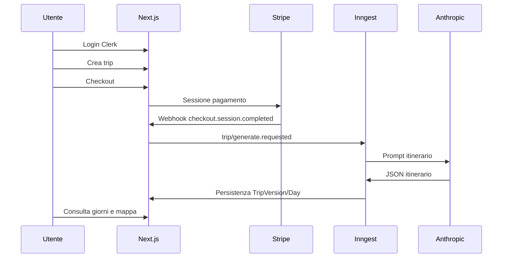

# EasyTrip — Manuale d’uso e indice documentazione

Applicazione **SaaS** per **itinerari di viaggio generati da IA** (Anthropic Claude), con **versionamento** degli itinerari, **mappe** (Leaflet), **gruppi e spese**, **Stripe** e job **Inngest**. Stack: **Next.js 16** (App Router), **React 19**, **Prisma** + **PostgreSQL**, **Clerk**.

Questo file è il **punto di ingresso** della documentazione tecnica aggiornata al codice in `easytrip-saas/`.

---

## Contratti API (OpenAPI + architettura)

| Ruolo | Percorso |
|-------|----------|
| **Specifica OpenAPI 3** (path, schemi, sicurezza) | [`docs/openapi.yaml`](docs/openapi.yaml) |
| **Descrizione narrativa, inventario route, assenza Server Actions** | [`architecture-docs/04_API_SPECIFICATION.md`](architecture-docs/04_API_SPECIFICATION.md) |

I due artefatti sono **incrociati**: `openapi.yaml` espone `externalDocs` verso `04_API_SPECIFICATION.md`; la sezione 2 di quel documento descrive il contratto strutturato e il flusso di manutenzione.

---

## Mappa documenti (`architecture-docs/`)

| # | File | Contenuto |
|---|------|-----------|
| 01 | [architecture-docs/01_PRODUCT_DEFINITION.md](architecture-docs/01_PRODUCT_DEFINITION.md) | Prodotto: generatore JSON, rigenerazione, GPS/slot |
| 02 | [architecture-docs/02_ARCHITECTURE.md](architecture-docs/02_ARCHITECTURE.md) | Architettura: Next.js, DI, Inngest, integrazioni |
| 03 | [architecture-docs/03_DATABASE.md](architecture-docs/03_DATABASE.md) | Database: ER Prisma, enum, retention |
| 04 | [architecture-docs/04_API_SPECIFICATION.md](architecture-docs/04_API_SPECIFICATION.md) | API REST, integrazione OpenAPI, assenza di Server Actions |
| 05 | [architecture-docs/05_VALIDATION_ZOD.md](architecture-docs/05_VALIDATION_ZOD.md) | Validazione Zod (env, trip, AI) |
| 06 | [architecture-docs/06_DESIGN_SYSTEM.md](architecture-docs/06_DESIGN_SYSTEM.md) | UI: Tailwind v4, Lucide; nessuno shadcn/ui |
| 07 | [architecture-docs/07_PAYMENTS_STRIPE.md](architecture-docs/07_PAYMENTS_STRIPE.md) | Stripe: checkout, webhook, subscription opzionale |
| 08 | [architecture-docs/08_DEVOPS_VERCEL.md](architecture-docs/08_DEVOPS_VERCEL.md) | Vercel, env, servizi esterni |
| 09 | [architecture-docs/09_SECURITY_CLERK.md](architecture-docs/09_SECURITY_CLERK.md) | Clerk, rate limit, privacy API |
| 10 | [architecture-docs/10_INNGEST_SLOTS.md](architecture-docs/10_INNGEST_SLOTS.md) | Inngest, generazione, slot/GPS, live suggest |
| 11 | [architecture-docs/11_OBSERVABILITY.md](architecture-docs/11_OBSERVABILITY.md) | PostHog, log, dashboard Inngest/Stripe |
| 12 | [architecture-docs/12_DEPLOYMENT.md](architecture-docs/12_DEPLOYMENT.md) | CI/CD GitHub Actions, go-live |

---

## Avvio rapido (sviluppatore)

| Passo | Comando / azione |
|-------|-------------------|
| Dipendenze | `cd easytrip-saas && npm ci` |
| Variabili | Copiare da [`.env.example`](.env.example) e impostare almeno `DATABASE_URL`, Clerk, Stripe, `ANTHROPIC_API_KEY` |
| DB | `npx prisma migrate dev` o `db push` (solo dev) |
| Dev server | `npm run dev` |
| Inngest locale | `npm run inngest:dev` (in terminale separato) |
| Qualità | `npm run lint`, `npm run typecheck`, `npm run test:unit` |

---

## Flusso funzionale sintetico



---

## Riferimenti codice chiave

| Area | Percorso |
|------|----------|
| Config | `src/config/unifiedConfig.ts` |
| Middleware auth | `src/middleware.ts` |
| Container DI | `src/server/di/container.ts` |
| Webhook Stripe | `src/app/api/webhooks/stripe/route.ts` |
| Inngest | `src/app/api/inngest/route.ts`, `src/lib/inngest/functions/` |
| Schema DB | `prisma/schema.prisma` |
| OpenAPI | `docs/openapi.yaml` |
| Pitch HTML statico | `presentation.html` |

---

## Test

| Tipo | Script / riferimento |
|------|--------|
| Unit | `npm run test:unit` |
| Integration | `npm run test:integration` (richiede DB) |
| E2E | `npm run test:e2e` / `test:e2e:smoke` |
| QA manuale (Golden Path, stack) | [`docs/MASTER_TESTING_CHECKLIST.md`](docs/MASTER_TESTING_CHECKLIST.md) |

Pipeline: `.github/workflows/ci.yml` sulla cartella `easytrip-saas/`.

### Screenshot per presentazione (`docs/presentation-screenshots/`)

Generazione PNG end-to-end con Playwright ([`tests/e2e/presentation-screenshots.spec.ts`](tests/e2e/presentation-screenshots.spec.ts), config [`playwright.presentation.config.ts`](playwright.presentation.config.ts)):

| Script | Uso |
|--------|-----|
| `npm run screenshots:presentation` | Cattura gli screenshot (avvio `npm run dev` riusato se già in ascolto). |
| `npm run screenshots:clerk-session` | Prepara lo storage Clerk per gli shot autenticati (vedi config dedicata). |

Variabili d’ambiente rilevanti:

| Variabile | Descrizione |
|-----------|-------------|
| `E2E_BASE_URL` | Base URL dell’app (default `http://127.0.0.1:3000`); deve coincidere con l’URL usato per creare la sessione Clerk. |
| `E2E_AUTH_STORAGE_STATE` | Percorso del file JSON di storage Playwright (es. `e2e/.auth/user.json`) dopo login; senza questo file vengono generati solo `01-landing.png` e `02-auth-clerk.png`. |
| `E2E_TRIP_ID` | ID (`uuid`) di un viaggio esistente per `05-trip-detail.png`, `05b-trip-detail-checkout-cta.png` (sezione pagamento visibile solo se il viaggio non è ancora pagato e l’utente è organizzatore) e opzionalmente `10-checkout-stripe.png`. |
| `E2E_JOIN_TOKEN` | Token invito gruppo per `08-join-trip.png` (opzionale). |
| `E2E_SCREENSHOT_STRIPE` | Se `1` o `true`, dopo il dettaglio viaggio prova il click sul checkout e salva `10-checkout-stripe.png` su Stripe (richiede trip idoneo e Stripe in modalità test). |
| `E2E_CLERK_USER_EMAIL` | (Solo per `screenshots:clerk-session`) Email utente Clerk dev/test — obbligatoria per generare `e2e/.auth/user.json` ([`presentation-auth.setup.ts`](tests/e2e/presentation-auth.setup.ts)). |
| `E2E_CLERK_USER_PASSWORD` | Opzionale: se impostata, login con strategia password; altrimenti Clerk usa il flusso email-only. |

Ordine consigliato per la serie completa `03`–`09`: avviare `npm run dev` (o attendere che `reuseExistingServer` trovi l’URL); eseguire `npm run screenshots:clerk-session` con le variabili Clerk; impostare `E2E_AUTH_STORAGE_STATE=e2e/.auth/user.json` e `E2E_TRIP_ID=...`; poi `npm run screenshots:presentation`.

**Nota:** lo script **non** invia la cancellazione account: `09-account-privacy.png` mostra solo la pagina Privacy e dati personali (`/app/account/privacy`) con export e modulo di conferma. Eseguire la cancellazione reale invalida la sessione salvata e va evitato nei run automatici di screenshot.

#### Procedura passo passo (PNG `01`–`10`, incluse le opzionali)

1. **Terminale** (da `easytrip-saas/`): avvia **`npm run dev`** e attendi `Ready` (o lascia che Playwright avvii il server: può richiedere fino a ~3 minuti al primo avvio).
2. **Chiavi Clerk in modalità test** (`pk_test_…` / `sk_test_…` in `.env`): lo script `screenshots:clerk-session` usa `@clerk/testing` (Testing Token).
3. **Crea o modifica** `.env.local` (non committare) con almeno:
   - `E2E_BASE_URL=http://127.0.0.1:3000` (stesso host usato in browser; se usi `localhost`, usa quello ovunque).
   - `E2E_CLERK_USER_EMAIL=tua@email.com` — utente **esistente** in Clerk dev/test (stesso progetto delle chiavi nell’`.env`).
   - `E2E_CLERK_USER_PASSWORD=…` — **consigliato** se l’utente ha login password; altrimenti il setup usa email-only (può richiedere interazione manuale).
   - `E2E_TRIP_ID=…` — ID del viaggio (es. `cmnmc2u4e0004u9z4cowzy5cw`): deve essere un viaggio dell’utente sopra, altrimenti il dettaglio fallisce.
   - `E2E_AUTH_STORAGE_STATE=e2e/.auth/user.json` — dopo il passo 5 il file esiste e questa riga serve a `screenshots:presentation`.
   - Opzionale **`E2E_JOIN_TOKEN`** — token reale da un link invito `…/join/<token>` per generare `08-join-trip.png`; senza token, lo `08` non viene creato.
   - Opzionale **`E2E_SCREENSHOT_STRIPE=1`** — per tentare `10-checkout-stripe.png` (redirect a Stripe; serve trip **non pagato** come organizzatore, Stripe test configurato).
4. **Installa browser Playwright** (una volta): `npx playwright install firefox`.
5. **Sessione Clerk salvata** (genera `e2e/.auth/user.json`):

   ```bash
   npm run screenshots:clerk-session
   ```

6. **Tutti gli screenshot** (inclusi `03`–`09`, `05b`, e `10` se abilitato):

   ```bash
   npm run screenshots:presentation
   ```

Output atteso in `docs/presentation-screenshots/`: `01`–`02` sempre; `03`–`07`, `09` con sessione valida; `05`/`05b`/`10` con `E2E_TRIP_ID` e condizioni trip; `08` solo con `E2E_JOIN_TOKEN`.

---

## Note

- I documenti in `architecture-docs/` sono redatti **dal codice** e sostituiscono la documentazione Markdown precedentemente distribuita in root/`docs/` (file rimossi come da richiesta operativa).
- Per integrazioni client e review contratti usare **`docs/openapi.yaml`** insieme a [04_API_SPECIFICATION.md](architecture-docs/04_API_SPECIFICATION.md).
