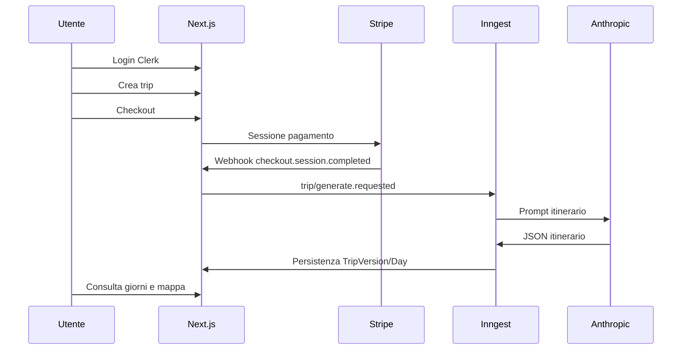

# EasyTrip — Manuale d’uso e indice documentazione

Applicazione **SaaS** per **itinerari di viaggio generati da IA** (Anthropic Claude), con **versionamento** degli itinerari, **mappe** (Leaflet), **gruppi e spese**, **Stripe** e job **Inngest**. Stack: **Next.js 16** (App Router), **React 19**, **Prisma** + **PostgreSQL**, **Clerk**.

Questo file è il **punto di ingresso** della documentazione tecnica aggiornata al codice in `easytrip-saas/`.

---

## Contratti API (OpenAPI + architettura)

| Ruolo                                                               | Percorso                                                                                 |
| ------------------------------------------------------------------- | ---------------------------------------------------------------------------------------- |
| **Specifica OpenAPI 3** (path, schemi, sicurezza)                   | [`docs/openapi.yaml`](docs/openapi.yaml)                                                 |
| **Descrizione narrativa, inventario route, assenza Server Actions** | [`architecture-docs/04_API_SPECIFICATION.md`](architecture-docs/04_API_SPECIFICATION.md) |

I due artefatti sono **incrociati**: `openapi.yaml` espone `externalDocs` verso `04_API_SPECIFICATION.md`; la sezione 2 di quel documento descrive il contratto strutturato e il flusso di manutenzione.

---

## Mappa documenti (`architecture-docs/`)

| #   | File                                                                                         | Contenuto                                                     |
| --- | -------------------------------------------------------------------------------------------- | ------------------------------------------------------------- |
| 01  | [architecture-docs/01_PRODUCT_DEFINITION.md](architecture-docs/01_PRODUCT_DEFINITION.md)     | Prodotto: generatore JSON, rigenerazione, GPS/slot            |
| 02  | [architecture-docs/02_ARCHITECTURE.md](architecture-docs/02_ARCHITECTURE.md)                 | Architettura: Next.js, DI, Inngest, integrazioni              |
| 03  | [architecture-docs/03_DATABASE.md](architecture-docs/03_DATABASE.md)                         | Database: ER Prisma, enum, retention                          |
| 04  | [architecture-docs/04_API_SPECIFICATION.md](architecture-docs/04_API_SPECIFICATION.md)       | API REST, integrazione OpenAPI, assenza di Server Actions     |
| 05  | [architecture-docs/05_VALIDATION_ZOD.md](architecture-docs/05_VALIDATION_ZOD.md)             | Validazione Zod (env, trip, AI)                               |
| 06  | [architecture-docs/06_DESIGN_SYSTEM.md](architecture-docs/06_DESIGN_SYSTEM.md)               | UI: Tailwind v4, Lucide; nessuno shadcn/ui                    |
| 07  | [architecture-docs/07_PAYMENTS_STRIPE.md](architecture-docs/07_PAYMENTS_STRIPE.md)           | Stripe: checkout, webhook, subscription opzionale             |
| 08  | [architecture-docs/08_DEVOPS_VERCEL.md](architecture-docs/08_DEVOPS_VERCEL.md)               | Vercel, env, servizi esterni                                  |
| 09  | [architecture-docs/09_SECURITY_CLERK.md](architecture-docs/09_SECURITY_CLERK.md)             | Clerk, rate limit, privacy API                                |
| 10  | [architecture-docs/10_INNGEST_SLOTS.md](architecture-docs/10_INNGEST_SLOTS.md)               | Inngest, generazione, slot/GPS, live suggest                  |
| 11  | [architecture-docs/11_OBSERVABILITY.md](architecture-docs/11_OBSERVABILITY.md)               | PostHog, Vercel Analytics/Speed Insights, log, Inngest/Stripe |
| 12  | [architecture-docs/12_DEPLOYMENT.md](architecture-docs/12_DEPLOYMENT.md)                     | CI/CD GitHub Actions, go-live                                 |
| 13  | [architecture-docs/13_CICD_SECRETS_AND_DNS.md](architecture-docs/13_CICD_SECRETS_AND_DNS.md) | Segreti Vercel/GitHub, post-deploy, DNS Hostinger             |

---

## Avvio rapido (sviluppatore)

| Passo          | Comando / azione                                                                                                |
| -------------- | --------------------------------------------------------------------------------------------------------------- |
| Dipendenze     | `cd easytrip-saas && npm ci`                                                                                    |
| Variabili      | Copiare da [`.env.example`](.env.example) e impostare almeno `DATABASE_URL`, Clerk, Stripe, `ANTHROPIC_API_KEY` |
| DB             | `npx prisma migrate dev` o `db push` (solo dev)                                                                 |
| Dev server     | `npm run dev`                                                                                                   |
| Inngest locale | `npm run inngest:dev` (in terminale separato)                                                                   |
| Qualità        | `npm run lint`, `npm run typecheck`, `npm run test:unit`                                                        |

---

## Flusso funzionale sintetico



---

## Riferimenti codice chiave

| Area               | Percorso                                                     |
| ------------------ | ------------------------------------------------------------ |
| Config             | `src/config/unifiedConfig.ts`                                |
| Middleware auth    | `src/middleware.ts`                                          |
| Container DI       | `src/server/di/container.ts`                                 |
| Webhook Stripe     | `src/app/api/webhooks/stripe/route.ts`                       |
| Inngest            | `src/app/api/inngest/route.ts`, `src/lib/inngest/functions/` |
| Schema DB          | `prisma/schema.prisma`                                       |
| OpenAPI            | `docs/openapi.yaml`                                          |
| Pitch HTML statico | `presentation.html`                                          |

---

## Test

| Tipo                            | Script / riferimento                                                   |
| ------------------------------- | ---------------------------------------------------------------------- |
| Unit                            | `npm run test:unit`                                                    |
| Integration                     | `npm run test:integration` (richiede DB)                               |
| E2E                             | `npm run test:e2e` / `test:e2e:smoke`                                  |
| QA manuale (Golden Path, stack) | [`docs/MASTER_TESTING_CHECKLIST.md`](docs/MASTER_TESTING_CHECKLIST.md) |

Pipeline: `.github/workflows/main.yml` sulla cartella `easytrip-saas/`.

### Screenshot per presentazione (`docs/presentation-screenshots/`)

Generazione PNG end-to-end con Playwright ([`tests/e2e/presentation-screenshots.spec.ts`](tests/e2e/presentation-screenshots.spec.ts), config [`playwright.presentation.config.ts`](playwright.presentation.config.ts)):

| Script                              | Uso                                                                       |
| ----------------------------------- | ------------------------------------------------------------------------- |
| `npm run screenshots:presentation`  | Cattura gli screenshot (avvio `npm run dev` riusato se già in ascolto).   |
| `npm run screenshots:clerk-session` | Prepara lo storage Clerk per gli shot autenticati (vedi config dedicata). |

Variabili d’ambiente rilevanti:

| Variabile                 | Descrizione                                                                                                                                                                                                                               |
| ------------------------- | ----------------------------------------------------------------------------------------------------------------------------------------------------------------------------------------------------------------------------------------- |
| `E2E_BASE_URL`            | Base URL dell’app (default `http://127.0.0.1:3000`); deve coincidere con l’URL usato per creare la sessione Clerk.                                                                                                                        |
| `E2E_AUTH_STORAGE_STATE`  | Percorso del file JSON di storage Playwright (es. `e2e/.auth/user.json`) dopo login; senza questo file vengono generati solo la parte pubblica: `01-landing.png`, `02-auth-clerk.png`, `02b-auth-clerk-signup.png` (best effort) e eventuali fallimenti successivi. |
| `E2E_TRIP_ID`             | ID (`cuid`/id Prisma) di un viaggio esistente per `05-trip-detail.png`, `05b-trip-detail-checkout-cta.png` (CTA solo se trip non pagato), `05c-trip-expenses.png` (solo tipologia **gruppo** o **coppia**, pagato, ≥2 membri, con giorni) e opzionalmente `10-checkout-stripe.png`. |
| `E2E_JOIN_TOKEN`          | Token invito gruppo (`08-join-trip.png`, opzionale): solo il segmento dopo `/join/`, oppure un URL completo del link — viene estratto automaticamente.                                                                                                                             |
| `E2E_SCREENSHOT_STRIPE`   | Se `1` o `true`, dopo il dettaglio viaggio prova il click sul checkout e salva `10-checkout-stripe.png` su Stripe (richiede trip idoneo e Stripe in modalità test).                                                                       |
| `E2E_CLERK_USER_EMAIL`    | (Per `screenshots:clerk-session`) Email dell’utente esistente in Clerk — obbligatoria per `e2e/.auth/user.json`.                                                                                                                         |
| `CLERK_SECRET_KEY`       | (**Consigliata** per gli screenshot): deve essere caricata nel processo Playwright (di solito da `.env` accanto ai `pk_test_`/`sk_test_`). Con la chiave, il login usa il **ticket** API (stabile); senza, serve password sotto (meno affidabile). |
| `E2E_CLERK_USER_PASSWORD` | Solo fallback se **`CLERK_SECRET_KEY`** non è disponibile: login tramite password lato browser (può fallire con redirect su Clerk ospitato).                                                                                              |

Ordine consigliato per la serie completa `03`–`09`: avviare `npm run dev` (o attendere che `reuseExistingServer` trovi l’URL); eseguire `npm run screenshots:clerk-session` con le variabili Clerk; impostare `E2E_AUTH_STORAGE_STATE=e2e/.auth/user.json` e `E2E_TRIP_ID=...`; poi `npm run screenshots:presentation`.

**Nota:** lo script **non** invia la cancellazione account (`POST /api/user/delete-account`): `09-account-privacy.png` è la pagina intera; `09b-account-delete-form.png` ritaglia solo la sezione con il modulo di conferma (stesso stato, nessun invio). Eseguire la cancellazione reale invalida la sessione salvata e va evitato nei run automatici.

#### Inventario file PNG (ordine UX)

| File | Contenuto |
| ---- | --------- |
| `01-landing.png` | Landing marketing `/it` |
| `02-auth-clerk.png` | Gate Clerk su `/it/app/trips` (non autenticato) |
| `02b-auth-clerk-signup.png` | Schermata registrazione Clerk (click “Inizia ora” / best effort) |
| `03-app-dashboard.png` | Dashboard `/app` |
| `04-app-trips-list.png` | Elenco viaggi |
| `05-trip-detail.png` | Dettaglio viaggio (richiede `E2E_TRIP_ID`) |
| `05b-trip-detail-checkout-cta.png` | CTA pagamento se presente |
| `05c-trip-expenses.png` | Sezione split spese se presente nel trip |
| `06-trips-create-form.png` | Form creazione viaggio (crop) |
| `07-referral.png` | Referral |
| `08-join-trip.png` | Join invito (opzionale, `E2E_JOIN_TOKEN`) |
| `09-account-privacy.png` | Privacy, export, marketing |
| `09b-account-delete-form.png` | Modulo cancellazione account (crop, senza invio) |
| `10-checkout-stripe.png` | Stripe hosted (opzionale, `E2E_SCREENSHOT_STRIPE`) |

#### Procedura passo passo (PNG sopra, incluse le opzionali)

1. **Terminale** (da `easytrip-saas/`): avvia **`npm run dev`** e attendi `Ready` (o lascia che Playwright avvii il server: può richiedere fino a ~3 minuti al primo avvio).
2. **Chiavi Clerk in modalità test** (`pk_test_…` / `sk_test_…` in `.env`): lo script `screenshots:clerk-session` usa `@clerk/testing` (Testing Token).
3. **Crea o modifica** `.env.local` (non committare) con almeno:
   - `E2E_BASE_URL=http://127.0.0.1:3000` (stesso host usato in browser; se usi `localhost`, usa quello ovunque).
   - `E2E_CLERK_USER_EMAIL=tua@email.com` — utente **esistente** in Clerk (stesso progetto delle chiavi).
   - **`CLERK_SECRET_KEY`** in `.env` (o duplicata in `.env.local` solo in locale) — permette login automatico stabile (**ticket**) senza digitare password. Se Playwright non vede `.env`, copia almeno `CLERK_SECRET_KEY` in `.env.local`.
   - `E2E_CLERK_USER_PASSWORD` — fallback solo senza secret key (flusso meno affidabile).
   - `E2E_TRIP_ID=…` — ID del viaggio (es. `cmnmc2u4e0004u9z4cowzy5cw`): deve essere un viaggio dell’utente sopra, altrimenti il dettaglio fallisce.
   - `E2E_AUTH_STORAGE_STATE=e2e/.auth/user.json` — dopo il passo 5 il file esiste e questa riga serve a `screenshots:presentation`.
   - Opzionale **`E2E_JOIN_TOKEN`** — token reale da un link invito `…/join/<token>` per generare `08-join-trip.png`; senza token, lo `08` non viene creato.
   - Opzionale **`E2E_SCREENSHOT_STRIPE=1`** — per tentare `10-checkout-stripe.png` (redirect a Stripe; serve trip **non pagato** come organizzatore, Stripe test configurato).
4. **Installa browser Playwright** (una volta): `npx playwright install firefox`.
5. **Sessione Clerk salvata** (genera `e2e/.auth/user.json`):

   ```bash
   npm run screenshots:clerk-session
   ```

6. **Tutti gli screenshot** (inclusi `02b`, `03`–`09`, `05b`, `05c`, `09b`, e `10` se abilitato):

   ```bash
   npm run screenshots:presentation
   ```

Output atteso in `docs/presentation-screenshots/`: `01`–`02` e di solito `02b` senza sessione; con sessione valida `03`–`07`, `09`, `09b`; con `E2E_TRIP_ID` anche `05`/`05b`/`05c` (quest’ultimo se il trip è coppia/gruppo pagato con ≥2 membri) e opzionalmente `10`; `08` solo con `E2E_JOIN_TOKEN`.

---

## Note

- I documenti in `architecture-docs/` sono redatti **dal codice** e sostituiscono la documentazione Markdown precedentemente distribuita in root/`docs/` (file rimossi come da richiesta operativa).
- Per integrazioni client e review contratti usare **`docs/openapi.yaml`** insieme a [04_API_SPECIFICATION.md](architecture-docs/04_API_SPECIFICATION.md).
