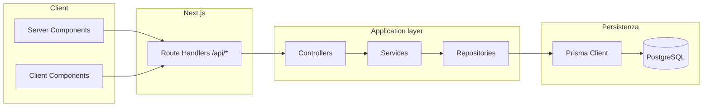

# 02 — Architettura di sistema

| Documento | Percorso                                             |
| --------- | ---------------------------------------------------- |
| Indice    | [README_00.md](../README_00.md)                      |
| Prodotto  | [01_PRODUCT_DEFINITION.md](01_PRODUCT_DEFINITION.md) |
| Database  | [03_DATABASE.md](03_DATABASE.md)                     |
| API       | [04_API_SPECIFICATION.md](04_API_SPECIFICATION.md)   |

## 1. Stack di runtime

| Layer      | Tecnologia           | Versione (package.json) |
| ---------- | -------------------- | ----------------------- |
| Framework  | Next.js (App Router) | 16.1.7                  |
| UI         | React                | 19.2.3                  |
| Linguaggio | TypeScript           | ^5                      |
| ORM        | Prisma               | 6.19.0                  |
| DB         | PostgreSQL           | (URL in `DATABASE_URL`) |

**Nota “Edge”**: il middleware Clerk è edge-compatible; le **API route** che usano Prisma, Stripe, Inngest o firma webhook dichiarano esplicitamente `runtime = "nodejs"` dove necessario (es. `api/inngest/route.ts`, `api/webhooks/stripe/route.ts`).

## 2. Pattern applicativo

- **Dependency injection leggera**: `src/server/di/container.ts` istanzia repositories, services e controllers.
- **Validazione**: schemi Zod in `src/server/validators/` e `unifiedConfig.ts` (env).

## 3. Job asincroni (Inngest)

Endpoint di sync: `GET|POST|PUT` → `src/app/api/inngest/route.ts`, `runtime: nodejs`, `dynamic: force-dynamic`.

Funzioni registrate:

| Funzione                | File                                              | Ruolo                                                |
| ----------------------- | ------------------------------------------------- | ---------------------------------------------------- |
| `generateItinerary`     | `src/lib/inngest/functions/generate-itinerary.ts` | Genera contenuti AI e persiste `TripVersion` / `Day` |
| `expireTrips`           | `expire-trips.ts`                                 | Stati/scadenze accesso                               |
| `creditExpiryReminders` | `credit-expiry-reminders.ts`                      | Promemoria crediti                                   |
| `preTripReminders`      | `pre-trip-reminders.ts`                           | Pre-viaggio                                          |
| `postTripFollowup`      | `post-trip-followup.ts`                           | Post-viaggio                                         |
| `dataRetentionPurge`    | `data-retention.ts`                               | Retention versioni / soft-delete                     |

## 4. Versioning itinerari

- Ogni trip ha `currentVersion` e fino a **7** versioni numerate (`TripVersion.versionNum`).
- Una versione è **attiva** (`isActive`) per la consultazione nel carosello UI.
- La generazione incrementa il numero di versione secondo le regole di dominio (`trip-regen-rules`, `TripService`).

## 5. Integrazioni esterne

| Servizio  | Uso                                         |
| --------- | ------------------------------------------- |
| Clerk     | Autenticazione sessione, protezione `/app`  |
| Stripe    | Checkout, webhook, subscription (opzionale) |
| Anthropic | Completamenti itinerario e slot             |
| Upstash   | Rate limit (opzionale se env assenti)       |
| Resend    | Email (opzionale)                           |
| PostHog   | Analytics client (`posthog-js`)             |
| Vercel Web Analytics | Visite e pagine viste (dashboard Vercel); pacchetto `@vercel/analytics` nel layout radice |
| Vercel Speed Insights | Core Web Vitals da traffico reale (RUM); pacchetto `@vercel/speed-insights` nel layout radice |

Dettaglio pagamenti: [07_PAYMENTS_STRIPE.md](07_PAYMENTS_STRIPE.md).  
Sicurezza route: [09_SECURITY_CLERK.md](09_SECURITY_CLERK.md).  
Osservabilità: [11_OBSERVABILITY.md](11_OBSERVABILITY.md).
