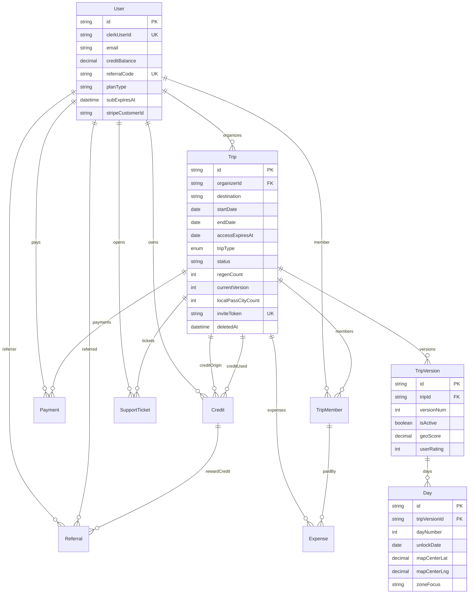

# 03 — Modello dati (Prisma)

| Documento | Percorso |
|-----------|----------|
| Indice | [README_00.md](../README_00.md) |
| Architettura | [02_ARCHITECTURE.md](02_ARCHITECTURE.md) |
| API | [04_API_SPECIFICATION.md](04_API_SPECIFICATION.md) |

## 1. Fonte di verità

Schema: [`prisma/schema.prisma`](../prisma/schema.prisma).  
Datasource: PostgreSQL via `DATABASE_URL`.

## 2. Diagramma entità-relazione (logico)

## 3. Enumerazioni principali

| Enum | Valori | Impiego |
|------|--------|---------|
| `TripStatus` | pending, active, expired, cancelled | Ciclo di vita trip |
| `TripType` | solo, coppia, gruppo | Pricing e prompt AI |
| `PaymentType` | purchase, regen, reactivate | Stripe + record `Payment` |
| `ExpenseCategory` | cibo, trasporti, attivita, alloggio, altro | Spese |
| `TicketStatus` / `TicketChannel` | — | Supporto |
| `ReferralStatus` | pending, signed_up, converted | Referral |

## 4. Note su itinerari e JSON

- I campi `morning`, `afternoon`, `evening`, `restaurants` su `Day` sono persistiti come stringhe (serializzazione JSON lato applicazione).
- `zoneFocus` alimenta `usedZones` sul `Trip` per variare le rigenerazioni.

## 5. Indici e vincoli rilevanti

- `TripMember`: `@@unique([tripId, userId])`
- `Referral`: `@@unique([referrerId, referredEmail])`
- `User.referralCode`: univoco dove valorizzato

## 6. Retention (config)

Valori da env (`unifiedConfig.ts`):

- `RETENTION_INACTIVE_TRIP_VERSION_DAYS` (default 365)
- `RETENTION_SOFT_DELETED_TRIP_DAYS` (default 90)

Implementazione job: `dataRetentionPurge` (Inngest).
