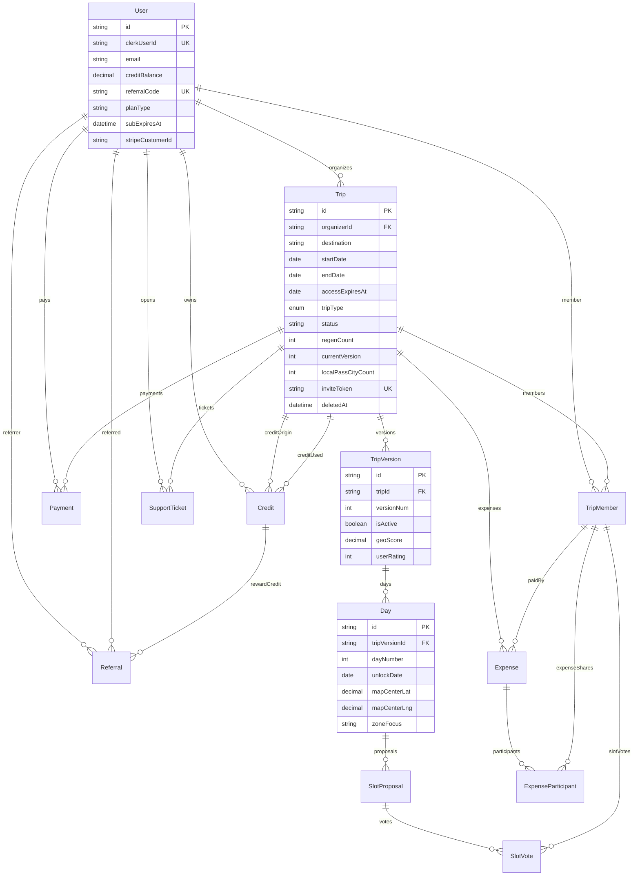

# 03 — Modello dati (Prisma)

| Documento    | Percorso                                           |
| ------------ | -------------------------------------------------- |
| Indice       | [README_00.md](../README_00.md)                    |
| Architettura | [02_ARCHITECTURE.md](02_ARCHITECTURE.md)           |
| API          | [04_API_SPECIFICATION.md](04_API_SPECIFICATION.md) |

## 1. Fonte di verità

Schema: [`prisma/schema.prisma`](../prisma/schema.prisma).  
Datasource: PostgreSQL via `DATABASE_URL`.

## 2. Diagramma entità-relazione (logico)

```mermaid
erDiagram
  User ||--o{ Trip : organizes
  User ||--o{ TripMember : member
  User ||--o{ Payment : pays
  User ||--o{ Credit : owns
  User ||--o{ SupportTicket : opens
  User ||--o{ Referral : referrer
  User ||--o{ Referral : referred

  Trip ||--o{ TripVersion : versions
  Trip ||--o{ TripMember : members
  Trip ||--o{ Expense : expenses
  Trip ||--o{ Payment : payments
  Trip ||--o{ Credit : creditOrigin
  Trip ||--o{ Credit : creditUsed
  Trip ||--o{ SupportTicket : tickets

  TripVersion ||--o{ Day : days
  Day ||--o{ SlotProposal : proposals
  SlotProposal ||--o{ SlotVote : votes
  TripMember ||--o{ SlotVote : slotVotes

  TripMember ||--o{ Expense : paidBy
  Expense ||--o{ ExpenseParticipant : participants
  TripMember ||--o{ ExpenseParticipant : expenseShares

  Credit ||--o{ Referral : rewardCredit

  User {
    string id PK
    string clerkUserId UK
    string email
    decimal creditBalance
    string referralCode UK
    string planType
    datetime subExpiresAt
    string stripeCustomerId
  }

  Trip {
    string id PK
    string organizerId FK
    string destination
    date startDate
    date endDate
    date accessExpiresAt
    enum tripType
    string status
    int regenCount
    int currentVersion
    int localPassCityCount
    string inviteToken UK
    datetime deletedAt
  }

  TripVersion {
    string id PK
    string tripId FK
    int versionNum
    boolean isActive
    decimal geoScore
    int userRating
  }

  Day {
    string id PK
    string tripVersionId FK
    int dayNumber
    date unlockDate
    decimal mapCenterLat
    decimal mapCenterLng
    string zoneFocus
  }
```

## 3. Enumerazioni principali

| Enum                             | Valori                                     | Impiego                   |
| -------------------------------- | ------------------------------------------ | ------------------------- |
| `TripStatus`                     | pending, active, expired, cancelled        | Ciclo di vita trip        |
| `TripType`                       | solo, coppia, gruppo                       | Pricing e prompt AI       |
| `PaymentType`                    | purchase, regen, reactivate                | Stripe + record `Payment` |
| `ExpenseCategory`                | cibo, trasporti, attivita, alloggio, altro | Spese                     |
| `TicketStatus` / `TicketChannel` | —                                          | Supporto                  |
| `ReferralStatus`                 | pending, signed_up, converted              | Referral                  |

## 4. Note su itinerari e JSON

- I campi `morning`, `afternoon`, `evening`, `restaurants` su `Day` sono persistiti come stringhe (serializzazione JSON lato applicazione).
- `zoneFocus` alimenta `usedZones` sul `Trip` per variare le rigenerazioni.
- **Spese e split** (`Expense`, `ExpenseParticipant`, tabella `expense_participant`): `splitEqually=false` = spesa **personale**, esclusa da `totalPaid` e dai saldi; `splitEqually=true` = spesa di gruppo. Una spesa di gruppo **senza** righe `ExpenseParticipant` è divisa in parti uguali tra tutti i membri (comportamento storico, nessun backfill); **con** righe è divisa solo tra i membri elencati, in proporzione a `weight` (1 = quota intera, max 2 decimali). Il pagatore non deve essere un partecipante. I saldi si calcolano in centesimi interi (`src/lib/expense-split.ts`, metodo del resto maggiore): la somma dei saldi è esattamente 0.
- **Group voting sugli slot** (`SlotProposal` → `slot_proposal`, `SlotVote` → `slot_vote`): quando `replace-slot` produce alternative in un viaggio con almeno 2 membri, il server salva una proposta in stato `draft` con `options` (`Json`: da 2 a 4 opzioni di slot completo `{ slot, distance, note }`; l'indice 0 è sempre lo slot attuale). L'organizzatore la porta a `open` (scadenza dopo 24h, `SLOT_VOTE_WINDOW_HOURS`); ogni membro ha al più un voto (`@@unique([proposalId, memberId])`, modificabile). Si chiude (`resolved`, `winnerIndex`) quando un'opzione ha la maggioranza stretta dei membri, quando hanno votato tutti, per chiusura anticipata dell'organizzatore o per scadenza (job orario). A parità resta lo slot attuale; senza voti resta l'attuale. Una nuova sostituzione dello stesso slot elimina la bozza precedente e annulla (`cancelled`) una votazione aperta. Il contenuto delle opzioni proviene sempre dal database, mai dal client. La chiusura è idempotente (update condizionale `status = open` in transazione con l'applicazione dello slot). Cascade su `Day`, `TripMember` e quindi `Trip`.
- **GeoScore** (`TripVersion.geoScore`, `Decimal(3,1)`, scala 1–10): dalla generazione con calcolo indipendente è il punteggio **calcolato dalle coordinate** degli slot (`src/lib/geo-optimization.ts`: compattezza dei percorsi giornalieri + efficienza dell'ordine, formula di Haversine), non più l'`optimizationScore` dichiarato dal modello. Il valore dichiarato resta come ripiego quando le coordinate non bastano (meno del 50% dei giorni con almeno 2 tappe localizzate) e nei log di confronto. Le versioni generate prima restano col valore dichiarato finché non vengono rigenerate, modificate (sostituzione di uno slot) o allineate con `npx tsx scripts/geo-score-report.ts --apply`; il dettaglio viaggio e la card di condivisione ricalcolano comunque il punteggio della versione attiva alla lettura.
- `VerifiedPoiCache` (tabella `verified_poi_cache`): cache **condivisa tra utenti**, una riga per destinazione (`destinationKey` normalizzata, univoca), con `payload` (`Json`/jsonb: aree, attrazioni, ristoranti verificati via `web_search`), `sources` (`Json`: URL consultati) e `expiresAt` (TTL `VERIFIED_POI_TTL_DAYS`, default 30). Solo dati pubblici, nessun dato personale.

## 5. Indici e vincoli rilevanti

- `TripMember`: `@@unique([tripId, userId])`
- `Referral`: `@@unique([referrerId, referredEmail])`
- `User.referralCode`: univoco dove valorizzato

## 6. Retention (config)

Valori da env (`unifiedConfig.ts`):

- `RETENTION_INACTIVE_TRIP_VERSION_DAYS` (default 365)
- `RETENTION_SOFT_DELETED_TRIP_DAYS` (default 90)

Implementazione job: `dataRetentionPurge` (Inngest).
