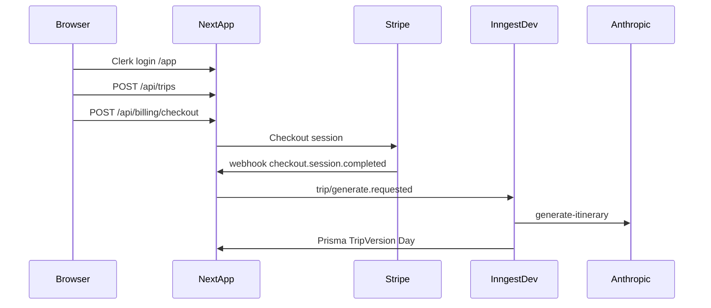

# Master Testing Checklist — EasyTrip SaaS

Guida operativa punto-punto per test manuali end-to-end su `easytrip-saas/`, basata sul codice: percorso utente (Golden Path), verifiche stack lato sviluppatore (DB, Inngest, Stripe, AI, Resend, Upstash, Crisp), punti di fallimento tipici e simulazione errori AI (percorsi sincroni vs job Inngest).

**Riferimenti codice:** [`src/middleware.ts`](../src/middleware.ts), [`prisma/schema.prisma`](../prisma/schema.prisma), [`src/app/api/inngest/route.ts`](../src/app/api/inngest/route.ts), [`src/lib/inngest/client.ts`](../src/lib/inngest/client.ts), [`POST /api/webhooks/stripe`](../src/app/api/webhooks/stripe/route.ts), [`src/lib/rate-limit.ts`](../src/lib/rate-limit.ts), [`src/lib/email/transactional.ts`](../src/lib/email/transactional.ts), [`src/app/app/crisp-chat.tsx`](../src/app/app/crisp-chat.tsx), [`src/config/unifiedConfig.ts`](../src/config/unifiedConfig.ts).

## Comandi stack locale (tre terminali)

1. **Next.js:** `npm run dev` — app su `http://localhost:3000`.
2. **Inngest Dev Server:** `npm run inngest:dev` — dashboard su `http://localhost:8288`, sync con `http://localhost:3000/api/inngest`.
3. **Stripe webhook (test):** `stripe listen --forward-to localhost:3000/api/webhooks/stripe` — aggiorna `STRIPE_WEBHOOK_SECRET` con il secret `whsec_…` mostrato dalla CLI.

## Prerequisiti locali (prima di aprire il browser)

- Da `easytrip-saas/`: `npm run dev` (Next su `http://localhost:3000`).
- **Inngest Dev Server** (obbligatorio per eseguire i job in locale): terminale separato — `npm run inngest:dev` (`inngest-cli dev -u http://localhost:3000/api/inngest`). Il client usa `isDev: true` in development ([`src/lib/inngest/client.ts`](../src/lib/inngest/client.ts)) così gli eventi non restano solo “cloud” senza funzioni registrate.
- **Database**: `DATABASE_URL` valido; migrazioni applicate (`npx prisma migrate dev` o equivalente).
- **Stripe Test Mode**: chiavi `sk_test_` / webhook secret; per webhook locali: **Stripe CLI** `stripe listen --forward-to localhost:3000/api/webhooks/stripe` e usare il signing secret che la CLI stampa (allineato a `STRIPE_WEBHOOK_SECRET` in env). Vedi [`architecture-docs/07_PAYMENTS_STRIPE.md`](../architecture-docs/07_PAYMENTS_STRIPE.md).
- **Variabili critiche** (estratte da `unifiedConfig`): copia [`.env.example`](../.env.example) in `.env` e compila `NEXT_PUBLIC_CLERK_PUBLISHABLE_KEY`, `CLERK_SECRET_KEY`, `STRIPE_*`, `DATABASE_URL`, `ANTHROPIC_API_KEY`, `APP_BASE_URL` (redirect Stripe/email; default `http://localhost:3000`). Opzionali ma utili al test: `RESEND_API_KEY` + `EMAIL_FROM`, `UPSTASH_REDIS_REST_URL` + `UPSTASH_REDIS_REST_TOKEN`, `NEXT_PUBLIC_CRISP_WEBSITE_ID`.

---

## Fase 1 — Prospettiva cliente (User Journey / Golden Path)

Esegui in ordine con l’app aperta; annota ogni esito (OK / KO).

### 1.1 Accesso e registrazione (Clerk)

| Step | Azione visiva                                                      | Cosa ti aspetti                                                                                                               |
| ---- | ------------------------------------------------------------------ | ----------------------------------------------------------------------------------------------------------------------------- |
| 1    | Apri `/` poi vai a `/app` o `/app/trips` senza sessione            | Redirect al flusso Clerk (sign-in/sign-up) per `clerkMiddleware` + `auth.protect()`.                                          |
| 2    | Completa **sign-up** (email o metodo abilitato nel progetto Clerk) | Dopo il login, accesso a `/app` e creazione/aggancio utente app via `AuthService.getOrCreateCurrentUser` → riga `User` in DB. |

**Failure points Clerk**: chiavi `pk_test_` / `sk_test_` non dello stesso progetto Clerk; `localhost` non in allowed origins in Clerk; loop di redirect se env incompleto.

### 1.2 Creazione viaggio — senza LocalPass e con LocalPass

| Step | Azione                                                                                                             | Note prodotto                                                                                                                                            |
| ---- | ------------------------------------------------------------------------------------------------------------------ | -------------------------------------------------------------------------------------------------------------------------------------------------------- |
| 3    | Vai a creazione viaggio (form `create-trip-form.tsx`): compila destinazione, date, tipo, budget; **LocalPass = 0** | `POST /api/trips` con `localPassCityCount: 0`.                                                                                                           |
| 4    | Ripeti (secondo viaggio di test o stesso flusso documentato) con **LocalPass > 0**                                 | `localPassCityCount` salvato su `Trip` (`prisma/schema.prisma`); il checkout applica add-on in `billingService` (prezzi `STRIPE_PRICE_LOCALPASS_CENTS`). |

### 1.3 Checkout Stripe (Test Mode) e avvio generazione

| Step | Azione                                                   | Cosa vedere                                                                                                                                                                                                            |
| ---- | -------------------------------------------------------- | ---------------------------------------------------------------------------------------------------------------------------------------------------------------------------------------------------------------------- |
| 5    | Apri il dettaglio viaggio `/app/trips/[tripId]`          | Trip in `pending` finché non pagato; `TripService.requestItineraryGeneration` in **development** consente generazione senza pagamento se `amountPaid == null` (solo dev). In produzione serve pagamento.               |
| 6    | Clic **Vai al pagamento** → `POST /api/billing/checkout` | Redirect a Stripe Checkout (o percorso crediti `fullyPaidByCredit` in `trip-detail-client.tsx`).                                                                                                                       |
| 7    | Completa pagamento test (carta `4242…`)                  | Success redirect verso app; **webhook** deve ricevere `checkout.session.completed`.                                                                                                                                    |
| 8    | Attendi generazione itinerario                           | UI: `generating = trip.isPaid && trip.days.length === 0 && trip.status === "pending"` → polling `router.refresh` ogni 5s. Quando il job finisce: compaiono giorni (`Day`), `TripVersion`, stato aggiornato da Inngest. |

### 1.4 Itinerario AI (Claude) — “Golden Path” funzionale

| Step | Azione                                                                                                                                                                                    |
| ---- | ----------------------------------------------------------------------------------------------------------------------------------------------------------------------------------------- |
| 9    | Verifica che ogni giorno mostri slot (mattina/pomeriggio/sera), mappa se presente, punteggio/geo dove esposto.                                                                            |
| 10   | **Rigenerazione gratuita** (se consentita da `regenCount`): pulsante generazione → `POST /api/trips/[tripId]/generate` → evento `trip/generate.requested` → funzione `generateItinerary`. |
| 11   | **Rigenerazione a pagamento** (quando la business logic la richiede): `POST /api/billing/regen-checkout` → Stripe → webhook → nuova generazione.                                          |

### 1.5 Spese di gruppo e bilanci

| Step | Azione                                             | DB                                                                                                                   |
| ---- | -------------------------------------------------- | -------------------------------------------------------------------------------------------------------------------- |
| 12   | Aggiungi una o più **spese** dal dettaglio viaggio | Righe `Expense` legate a `Trip` e `TripMember`; verifica saldi membri se esposti in UI/API (`GET` saldi in OpenAPI). |

### 1.6 Sostituzione slot e “cosa faccio adesso” (live suggest)

| Step | Azione                                                                   | Riferimento                                                                                                                                                     |
| ---- | ------------------------------------------------------------------------ | --------------------------------------------------------------------------------------------------------------------------------------------------------------- |
| 13   | **Sostituisci slot** (mattina/pomeriggio/sera): usa GPS se richiesto     | `POST /api/trips/[tripId]/replace-slot` — [`architecture-docs/10_INNGEST_SLOTS.md`](../architecture-docs/10_INNGEST_SLOTS.md), rate limit `replaceSlotLimiter`. |
| 14   | **Live suggest** (“cosa faccio adesso”): concedi GPS, avvia suggerimento | `POST /api/trips/[tripId]/live-suggest` con `lat`/`lng` obbligatori.                                                                                            |

### 1.7 Invito membri al gruppo

| Step | Azione                                                                                                                                                                                             |
| ---- | -------------------------------------------------------------------------------------------------------------------------------------------------------------------------------------------------- |
| 15   | Dal dettaglio viaggio, genera/copia **link invito** (`inviteToken` su `Trip`). Con un secondo browser o profilo: `GET/POST /api/join/[token]` con rate limit `joinGetLimiter` / `joinPostLimiter`. |
| 16   | Verifica che il membro compaia in `TripMember` e possa usare le funzioni consentite al ruolo.                                                                                                      |

### 1.8 Supporto in-app (ticket) e Crisp

| Step | Azione                                                                                                                                                                |
| ---- | --------------------------------------------------------------------------------------------------------------------------------------------------------------------- |
| 17   | Crea un **ticket** da UI se presente (`POST /api/support`). In DB: `SupportTicket` + `SupportMessage`; campo opzionale `crispSessionId`.                              |
| 18   | **Widget Crisp**: se `NEXT_PUBLIC_CRISP_WEBSITE_ID` è impostato, in `/app` si carica `CrispChat`; prova `openCrispChat` da un pulsante “aiuto” sul dettaglio viaggio. |

### 1.9 Email Resend (percorsi transazionali)

Con `RESEND_API_KEY` + `EMAIL_FROM` configurati, dopo pagamento e a itinerario pronto il job invia email (`sendTransactionalEmail`, template `purchaseConfirmedHtml`, `itineraryReadyHtml`, ecc.). **Senza chiavi**, in dev vedi solo log strutturati (“mock”).

### 1.10 Cancellazione account

| Step | Azione                                                                                                                                                                                              |
| ---- | --------------------------------------------------------------------------------------------------------------------------------------------------------------------------------------------------- |
| 19   | Vai a **Privacy account** `/app/account/privacy`. Digita esattamente `DELETE_MY_ACCOUNT` e conferma → `POST /api/user/delete-account` → `UserDataService.deleteAccountForUser` poi `clerk.signOut`. |

---

## Fase 2 — Prospettiva developer (Stack Health Check)

### 2.1 Database (Prisma) — tabelle da ispezionare

Usa **Prisma Studio** (`npx prisma studio`) o query mirate.

| Azione utente           | Tabelle / campi da verificare                                                                                                |
| ----------------------- | ---------------------------------------------------------------------------------------------------------------------------- |
| Prima login / sign-up   | `User`: `clerk_user_id`, `email`, eventuale `referral_code` / `referred_by`.                                                 |
| Crea trip               | `Trip`: `organizer_id`, `destination`, date, `trip_type`, `budget_level`, `status`, `local_pass_city_count`, `invite_token`. |
| Dopo checkout Stripe    | `Trip`: `amount_paid`, `payment_id`; `Payment`: riga con `type`, `stripe_payment_id`, importo.                               |
| Dopo webhook (purchase) | Eventuale avvio generazione; poi `TripVersion`, `Day`, `Trip`: `regen_count`, `current_version`, `status`, `used_zones`.     |
| Spese                   | `Expense`, `TripMember.balance` / `total_paid`.                                                                              |
| Join gruppo             | `TripMember` nuova riga univoca `(trip_id, user_id)`.                                                                        |
| Ticket supporto         | `support_ticket`, `support_message`.                                                                                         |
| Delete account          | Utente e dati coerenti con policy in `userDataService`.                                                                      |

### 2.2 Inngest (Dev Dashboard `http://localhost:8288`)

| Verifica                 | Come                                                                                                                                                                                                            |
| ------------------------ | --------------------------------------------------------------------------------------------------------------------------------------------------------------------------------------------------------------- |
| Funzioni registrate      | Dev server collegato a `http://localhost:3000/api/inngest`; elenco include `generate-itinerary`, `expire-trips`, `credit-expiry-reminders`, `pre-trip-reminders`, `post-trip-followup`, `data-retention-purge`. |
| Evento generazione       | Dopo `POST /api/trips/.../generate` o webhook, cerca run su evento `trip/generate.requested`.                                                                                                                   |
| Step job                 | `carica-trip`, `genera-con-claude`, `salva-versione-e-giorni`, `email-itinerario-pronto`.                                                                                                                       |
| Webhook Stripe → Inngest | In `billingService.handleStripeWebhook`, ramo `purchase` invia `inngest.send({ name: "trip/generate.requested", data: { tripId } })`.                                                                           |

**Failure point**: Inngest dev non avviato → “generazione avviata” ma nessun giorno.

### 2.3 Stripe — webhook locali

| Step                                                                  | Azione                                                                                      |
| --------------------------------------------------------------------- | ------------------------------------------------------------------------------------------- |
| Avvia `stripe listen --forward-to localhost:3000/api/webhooks/stripe` | Copia il **webhook signing secret** nella env `STRIPE_WEBHOOK_SECRET`.                      |
| Esegui un checkout test                                               | Nella finestra CLI Stripe: eventi `checkout.session.completed`; risposta HTTP 200 dall’app. |
| Verifica idempotenza                                                  | Secondo webhook duplicato → log “idempotente” / skip (`findByStripePaymentId`).             |

**Failure points**: firma mancante → 400 `MISSING_SIGNATURE`; metadata senza `tripId`/`appUserId` → errore `INVALID_METADATA`.

### 2.4 AI (Claude) — parsing e UI

| Percorso                               | Cosa monitorare                                                                                                                         |
| -------------------------------------- | --------------------------------------------------------------------------------------------------------------------------------------- |
| **Itinerario (Inngest)**               | Validazione JSON in `generate-itinerary`; output = righe DB + eventuale email. Il frontend vede i dati via `GET /api/trips/[id]` (DTO). |
| **Replace slot / Live suggest (sync)** | In errore API, `trip-detail-client` imposta `setMsg(apiMsg(json))` — **qui l’errore AI è visibile in UI**.                              |

### 2.5 Resend

- **Con chiavi:** dashboard Resend → email inviate / bounce.
- **Senza chiavi:** log “Email transazionale (mock” in `sendTransactionalEmail`.

### 2.6 Upstash (rate limit)

Se `UPSTASH_REDIS_REST_*` **non** sono impostati, `enforceRateLimit` ritorna `null` → **nessun 429** in dev.

Con Redis configurato: stress su `POST /api/trips/[id]/generate` (limite `trip_generate` 15/min), `replace-slot`, `live-suggest`, join — attesi **429** con body `RATE_LIMITED`.

### 2.7 Crisp

Verifica caricamento script (Network: `client.crisp.chat/l.js`), assenza errori CSP (`src/lib/security-headers.ts`), e in dashboard Crisp sessioni/messaggi.

---

## Simulazione fallimento job AI e messaggio errore in UI

- **Generazione itinerario (Inngest)**: `POST /api/trips/.../generate` risponde subito OK; l’errore Claude avviene **nel job**. Se il job fallisce dopo i retry Inngest, **non è garantito** un messaggio dedicato nella pagina trip senza ulteriore implementazione. Evidenza: **dashboard Inngest** (run failed) + log server.

- **Percorsi sincroni (replace-slot, live-suggest)**: in caso di errore API, **`setMsg`** mostra il messaggio.

**Procedura manuale per vedere un errore in UI**

1. Completa un itinerario così replace-slot è disponibile.
2. (Solo ambiente di test) **Invalida temporaneamente** `ANTHROPIC_API_KEY` o `ANTHROPIC_MODEL`, **riavvia** `npm run dev`.
3. Invia **replace-slot** o **live-suggest** dal dettaglio viaggio.
4. Attesi: risposta HTTP errore → messaggio tramite `apiMsg` nella UI.

Per il **solo** job Inngest: modello invalido → **run failed** su Inngest Dev e trip ancora senza `Day`.

---

## Failure points comuni (checklist rapida)

| Area        | Sintomo                                      | Causa tipica                                                 |
| ----------- | -------------------------------------------- | ------------------------------------------------------------ |
| Clerk       | Redirect infinito o 401                      | Chiavi progetto sbagliate; URL non in allowed origins        |
| Inngest     | Nessuna generazione                          | `inngest:dev` non in esecuzione                              |
| Stripe      | Pagamento OK ma trip non pagato / non genera | Webhook non inoltrato o secret errato; `APP_BASE_URL` errato |
| Prisma      | Crash all’avvio                              | `DATABASE_URL` o schema non migrato                          |
| Resend      | Nessuna email reale                          | Chiavi mancanti (solo log mock)                              |
| Upstash     | Mai 429                                      | Redis non configurato (by design in dev)                     |
| Generazione | Spinner infinito                             | Job fallito: controllare Inngest                             |

---

## Miglioramento UX opzionale (fuori da questa checklist)

Per un messaggio esplicito quando Claude fallisce sulla **generazione principale** (Inngest), servirebbe aggiornare lo stato del trip su fallimento del job o esporre uno stato errore al client — non garantito dal codice attuale.
